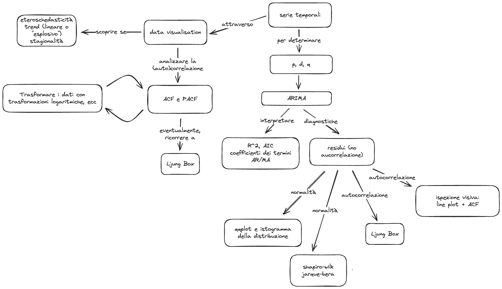

# Lecture Layout

* Use statistical tests like Box-Ljung to determine whether a series is auto-correlated.
* Preprocessing "tricks" to tame time-series: first differences and log transformations.
* Your first ARIMA model.
* Inspecting residuals for diagnostics.

```{r}
library(zoo)
library(xts)
library(forecast)

library(ggplot2)
theme_set(theme_minimal())

EuStockMarkets |> as.zoo() -> eu_stocks
nhtemp |> as.zoo() -> nh_temperature
AirPassengers |> as.zoo() -> air_passengers
JohnsonJohnson |> as.zoo() -> jj
```

# 1. Statistical tests for autocorrelation: the Box-Ljung text

## Mathematical Introduction

The Box-Ljung test is a statistical test used to determine whether a time series exhibits significant autocorrelation at multiple lags. It is particularly useful for checking the adequacy of models in time series analysis.

The Box-Ljung test examines whether the observed autocorrelations up to a certain lag \( h \) are significantly different from zero. If the test statistic \( Q \) is large, it suggests that the series has significant autocorrelations, indicating that the null hypothesis of no autocorrelation can be rejected.

Let's perform the Box-Ljung test on the log differenced series for each dataset.

```{r}
Box.test(nh_temperature, lag = 20, type = "Ljung-Box")
```

The p-value of the test will help determine if we reject the null hypothesis. A p-value less than 0.05 indicates significant autocorrelation.

```{r}
Box.test(air_passengers, lag = 20, type = "Ljung-Box")
```

```{r}
Box.test(jj, lag = 20, type = "Ljung-Box")
```

```{r}
Box.test(eu_stocks$DAX, lag = 20, type = "Ljung-Box")
```

We all expected the tests to confirm the hypothesis of significant correlation.

## 1.1 Log and Differenced Transformation

Let's revise the log transformation and first differencing procedure from the previous lecture. This time, we will compute the Box-Ljung test to see whether the residuals are autocorrelated.

### Final result on the data

```{r}
nh_temperature |>
  log() |>
  diff() -> nh_temperature_diff

nh_temperature_diff |>
  plot(main = "Log Differenced New Haven Temperature", ylab = "Log Differenced Temperature (Fahrenheit)", xlab = "Year")

nh_temperature_diff |>
  autocorr_plots(name = "Log Differenced New Haven Temperature")

nh_temperature_diff |> Box.test(lag = 5, type = "Ljung-Box")
```

```{r}
air_passengers |>
  log() |>
  diff() -> air_passengers_diff

air_passengers_diff |>
  plot(main = "Log Differenced Air Passengers", ylab = "Log Differenced Number of Passengers", xlab = "Year")

air_passengers_diff |>
  autocorr_plots(name = "Log Differenced Air Passengers")

air_passengers_diff |> Box.test(lag = 5, type = "Ljung-Box")
```

```{r}
jj |>
  log() |>
  diff() -> jj_diff

jj_diff |>
  plot(main = "Log Differenced Johnson & Johnson Quarterly Earnings", ylab = "Log Differenced Earnings per Share", xlab = "Year")

jj_diff |>
  autocorr_plots(name = "Log Differenced Johnson & Johnson Quarterly Earnings")

jj_diff |> Box.test(lag = 5, type = "Ljung-Box")
```

```{r}
eu_stocks$DAX |>
  log() |>
  diff() -> dax_diff

dax_diff |>
  plot(main = "Log Differenced DAX", ylab = "Log Differenced DAX", xlab = "Year")

dax_diff |>
  autocorr_plots(name = "Log Differenced DAX")

dax_diff |> Box.test(lag = 5, type = "Ljung-Box")
```

Why do all of the time series fail to reject the null hypothesis of serial autocorrelation? That's because we did not remove the seasonal component!

# 2. Your first ARIMA model

Let's have a look back at the (partial) autocorrelation plots to determine the appropriate number of AR and MA terms.

```{r}
nh_temperature |>
  autocorr_plots(name = "New Haven Temperature")
```

What `p` and `q` would you choose? The ACF is a bit ambiguous but it might be either 1 or 2. While the PACF is clearly 1.

```{r}
nh_temperature |>
  arima(order = c(1, 0, 1))

nh_temperature |>
  arima(order = c(2, 0, 1))
```

Compare the differences.

The `{forecast}` package offers an implementation of the `auto.arima` model, which uses some heuristics to determine the best parameters.

```{r}
nh_temperature |>
  auto.arima()
```

How do they differ from the parameters we found?

Finally, we should always inspect the residuals.

```{r}
nh_temperature_arima <- nh_temperature |>
  auto.arima()

nh_temperature_arima |> checkresiduals()
```

The plot displays the following:

1. The plot of the residuals themselves. We should always assess whether they are with mean zero and constant variance. This signifies we "extracted" all the meaning from the data.
2. The ACF of the residuals. We should always check whether there is any remaining autocorrelation in the residuals.
3. The histogram of the residuals. We should always check whether the residuals are normally distributed.

Note that the `checkresiduals` function also runs the Ljung-box test.

Another useful diagnostic tool is the Q-Q plot:

```{r}
nh_temperature_arima$residuals |> qqnorm()
qqline(nh_temperature_arima$residuals)
```

The idea behind this check is to see whether the residuals are (once again) normally distributed. We should also check this more thoroughly with a statistical test:

```{r}
shapiro.test(nh_temperature_arima$residuals)
```

The Shapiro-Wilk test's null hypothesis is that the data are not normally distributed. The p-values suggests we can reject the null. The same applies to the Jarque-Bera test:

```{r}
tseries::jarque.bera.test(nh_temperature_arima$residuals)
```

```{r}
check_normality <- function(arima) {
  residuals <- arima$residuals
  residuals |> qqnorm()
  qqline(residuals)

  shapiro <- shapiro.test(residuals)
  jarque <- tseries::jarque.bera.test(residuals)

  list(
    shapiro = shapiro$p.value,
    jarque = jarque$p.value
  )
}
```


Let's repeat this procedure with another dataset.

```{r}
air_passengers_arima <- air_passengers |>
  auto.arima()

air_passengers_arima

air_passengers_arima |>
  checkresiduals()

air_passengers_arima |> check_normality()
```

```{r}
air_passengers_arima_diff <- air_passengers_diff |>
  auto.arima()

air_passengers_arima_diff

air_passengers_arima_diff |>
  checkresiduals()

air_passengers_arima_diff |> check_normality()
```

# An example workflow


