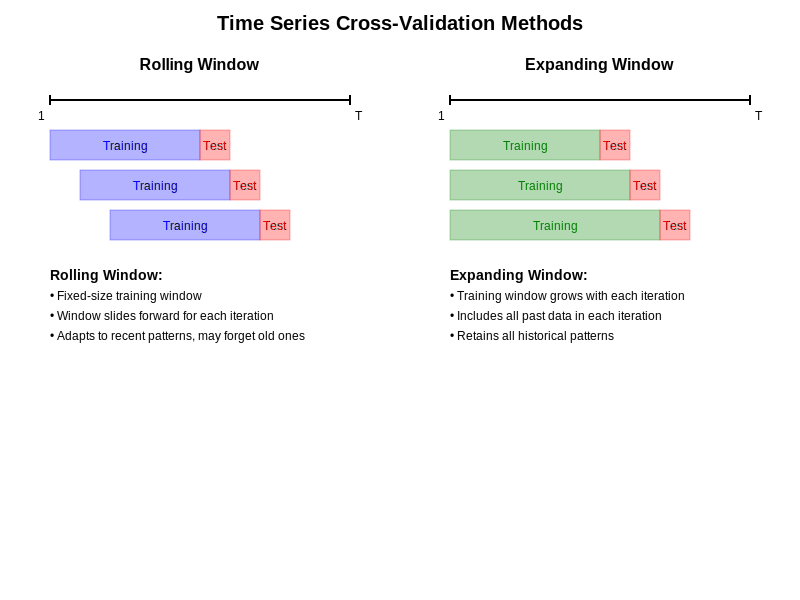

# 1. ARIMA Modeling

Now that we've analyzed the stationarity of our time series, let's move on to fitting ARIMA (AutoRegressive Integrated Moving Average) models to our data.

## 1.1 Using auto.arima()

The `auto.arima()` function from the `forecast` package in R automatically selects the best ARIMA model according to either AIC, AICc or BIC value. Let's fit ARIMA models to our four stock market indices:

```{r fit_arima}
arima_models <- lapply(colnames(EuStockMarkets), function(index) {
  auto.arima(EuStockMarkets[, index])
})

names(arima_models) <- colnames(EuStockMarkets)

for (index in names(arima_models)) {
  cat("ARIMA model for", index, ":\n")
  print(arima_models[[index]])
  cat("\n")
}
```

The output shows the selected ARIMA(p,d,q) model for each series, where:
- p is the order of the autoregressive term
- d is the degree of differencing
- q is the order of the moving average term

# 2. Root Mean Square Error (RMSE)

## 2.1 Defining RMSE

The Root Mean Square Error (RMSE) is a commonly used measure of the differences between values predicted by a model and the values actually observed. It represents the standard deviation of the residuals (prediction errors).

Mathematically, RMSE is defined as:

$$ RMSE = \sqrt{\frac{\sum_{t=1}^{n} (y_t - \hat{y}_t)^2}{n}} $$

Where:
- $y_t$ is the actual value at time t
- $\hat{y}_t$ is the predicted value at time t
- n is the number of observations

RMSE is particularly useful when large errors are especially undesirable, as it gives higher weight to large errors due to the squaring.

# 3. Cross-Validation for Time Series Forecasting

Cross-validation is a crucial technique for assessing how the results of a statistical analysis will generalize to an independent data set. For time series data, we need to use specialized cross-validation methods that respect the temporal nature of the data.




## 3.1 Rolling Window Cross-Validation

In rolling window cross-validation:
1. We start with a fixed-size window of data for training.
2. We make a forecast for the next time point.
3. We then slide the window forward by one time point, including the actual value for the time point we just predicted.
4. We repeat steps 2-3 until we reach the end of our data.


## 3.2 Expanding Window Cross-Validation

Expanding window cross-validation is similar, but instead of sliding a fixed-size window, we keep expanding our training set:
1. We start with an initial training set.
2. We make a forecast for the next time point.
3. We then add the actual value for the time point we just predicted to our training set.
4. We repeat steps 2-3 until we reach the end of our data.


Let's implement both methods and compute the RMSE for each of our time series:

```{r cross_validation}
# Function to perform cross-validation
cv_arima <- function(y, h = 1, window = 100, expanding = FALSE) {
  n <- length(y)
  errors <- numeric(n - window - h + 1)
  
  for (i in 1:(n - window - h + 1)) {
    if (expanding) {
      train <- y[1:(window + i - 1)]
    } else {
      train <- y[i:(window + i - 1)]
    }
    model <- auto.arima(train)
    forecast <- forecast(model, h = h)
    errors[i] <- y[window + i + h - 1] - forecast$mean[h]
  }
  
  return(sqrt(mean(errors^2)))
}

# Perform cross-validation for each series
cv_results <- data.frame(
  Index = character(),
  Rolling_RMSE = numeric(),
  Expanding_RMSE = numeric()
)

for (index in colnames(EuStockMarkets)) {
  rolling_rmse <- cv_arima(EuStockMarkets[, index], expanding = FALSE)
  expanding_rmse <- cv_arima(EuStockMarkets[, index], expanding = TRUE)
  
  cv_results <- rbind(cv_results, data.frame(
    Index = index,
    Rolling_RMSE = rolling_rmse,
    Expanding_RMSE = expanding_rmse
  ))
}

print(cv_results)
```

## 3.3 Interpreting the Results

The RMSE values we've computed represent the average prediction error for each of our stock market indices, using both rolling window and expanding window cross-validation methods.

- Lower RMSE values indicate better predictive performance.
- We can compare the rolling window and expanding window methods to see which performs better for each series.
- We can also compare RMSE across different indices to see which ones our ARIMA models are better at predicting.

It's important to note that these RMSE values are in the same units as our original data (stock prices), so they represent the average error in predicting the price of each index.
